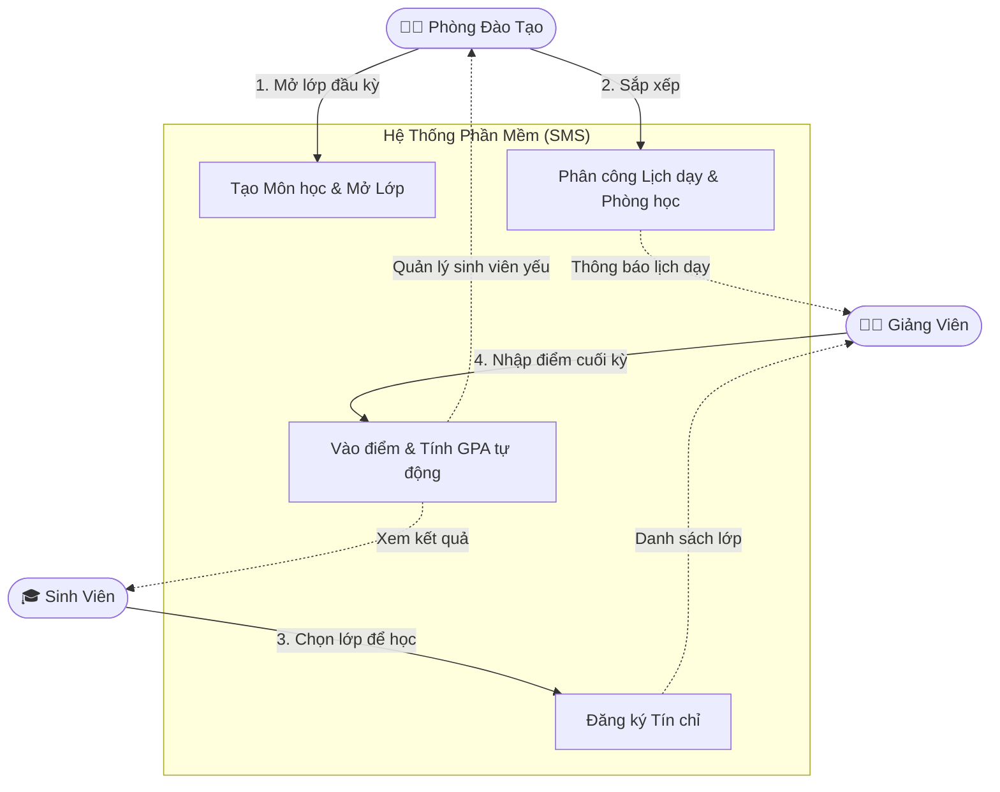

<div align="center">
  
  <h1>Hệ Thống Quản Lý Đào Tạo & Sinh Viên</h1>
  <p><strong>Student Management System (SMS)</strong></p>
  <p><em>Một giải pháp phần mềm toàn diện giúp các trường Đại học số hóa mọi hoạt động giảng dạy và học tập.</em></p>

  
  
  
  
</div>

---

## 📖 1. Dự án này giải quyết vấn đề gì?

Ở các trường Đại học, số lượng sinh viên và môn học là vô cùng lớn. Nếu không có phần mềm, việc sắp xếp lịch học, đăng ký tín chỉ hay chấm điểm sẽ cực kỳ hỗn loạn. 

**Dự án này là một trang web trọn gói giúp:**
- **Nhà trường:** Dễ dàng tạo lớp, xếp phòng học và theo dõi tình hình học tập của toàn bộ sinh viên.
- **Giảng viên:** Thoát khỏi đống sổ sách chấm điểm bằng tay. Mọi thứ được nhập thẳng lên web và tính toán tự động.
- **Sinh viên:** Có một cổng thông tin duy nhất để đăng ký môn học, xem lịch lên lớp và tra cứu điểm số.

---

## ✨ 2. Chi tiết các tính năng (Ai cũng có thể hiểu)

Trang web sẽ tự động nhận diện người đăng nhập là ai để hiển thị các tính năng phù hợp:

### 🧑‍💼 Dành cho Phòng Đào Tạo (Quản trị viên)
- **Tạo và quản lý lớp học:** Quyết định học kỳ này mở những môn nào, sĩ số bao nhiêu.
- **Phân công giảng dạy:** Sắp xếp giảng viên A dạy môn B ở phòng C.
- **Hệ thống cảnh báo học vụ:** Web sẽ tự động "nhặt" ra những sinh viên có điểm trung bình quá thấp để nhà trường kịp thời nhắc nhở.
- **Xuất báo cáo:** Tải danh sách điểm, danh sách lớp ra file Excel chỉ với 1 nút bấm.

### 👨‍🏫 Dành cho Giảng Viên
- **Xem thời khóa biểu:** Đăng nhập vào là biết ngay hôm nay mình dạy lúc mấy giờ, ở tòa nhà nào.
- **Nhập điểm trực tuyến & Import Excel:** Hỗ trợ nhập điểm trực tiếp trên web hoặc tải lên từ file Excel tiện lợi. Hệ thống sẽ tự động tính ra điểm tổng kết và xếp loại (A, B, C, D, F).
- **Khóa bảng điểm:** Khi đã nhập xong, giảng viên có thể "chốt" điểm để sinh viên vào xem.

### 🎓 Dành cho Sinh Viên
- **Đăng ký tín chỉ:** Giao diện trực quan giúp sinh viên chọn lớp trống, tránh trùng lịch học.
- **Xem thời khóa biểu:** Lịch học được hiển thị theo tuần, rõ ràng ngày giờ và phòng học.
- **Xem bảng điểm & Tiến độ:** Xem lại điểm các kỳ trước, biết mình đã học được bao nhiêu phần trăm chương trình đại học.

---

## 🔄 3. Sơ đồ cách hệ thống vận hành

*(Dưới đây là sơ đồ mô tả cách 3 nhóm người dùng tương tác với hệ thống)*



---

## 🚀 4. Hướng dẫn chạy thử dự án

Bạn muốn xem thử giao diện và dùng thử? Rất đơn giản, không cần biết code cũng làm được:

### Cách dễ nhất (Chạy 1-Click trên Windows)
1. Tải toàn bộ thư mục code này về máy.
2. Tìm file có tên **`start_dev.bat`** và nhấp đúp chuột vào nó.
3. Chờ một lát, màn hình đen (Terminal) sẽ tự động bật các dịch vụ. Khi xong, nó sẽ mở trang web lên cho bạn.

### Dành cho máy có cài Docker
Nếu máy bạn dùng Docker, chỉ cần gõ lệnh sau vào Terminal:
```bash
docker compose up --build -d
```
Sau đó mở trình duyệt web (Chrome/Edge) và vào đường dẫn: `http://localhost:5173`

---

## 🔐 5. Tài khoản dùng thử

Hệ thống đã tạo sẵn một số người dùng ảo để bạn đăng nhập thử. Hãy nhập vào ô Đăng nhập trên web:

| Bạn muốn trải nghiệm góc nhìn của ai? | Tên đăng nhập | Mật khẩu | 
| :--- | :--- | :--- | 
| **Phòng Đào Tạo** (Thấy tất cả mọi thứ) | `admin` | `123456` | 
| **Giảng Viên** (Chỉ thấy lịch dạy & lớp của mình)| `1000001` | `123456` | 
| **Sinh Viên** (Chỉ thấy điểm & lịch học của mình)| `2300001` | `123456` | 

---

## 📂 6. Cấu trúc thư mục (Bên trong code có gì?)

Dành cho những ai muốn mở code ra xem, dự án được chia làm các phần rất gọn gàng:

- 📁 **`backend/`**: Là "bộ não" của hệ thống (viết bằng Java). Nó tính toán điểm số, lưu dữ liệu và kiểm tra mật khẩu.
- 📁 **`frontend/`**: Là "bộ mặt" của hệ thống (viết bằng React). Chính là giao diện web tuyệt đẹp mà bạn nhìn thấy.
- 📁 **`database/`**: Nơi chứa cấu trúc kho lưu trữ dữ liệu (MySQL).
- 📁 **`docs/`**: Chứa các tài liệu phân tích thiết kế, bản vẽ ban đầu của dự án.

---
*Phát triển bởi DevMarkie - 2026*
