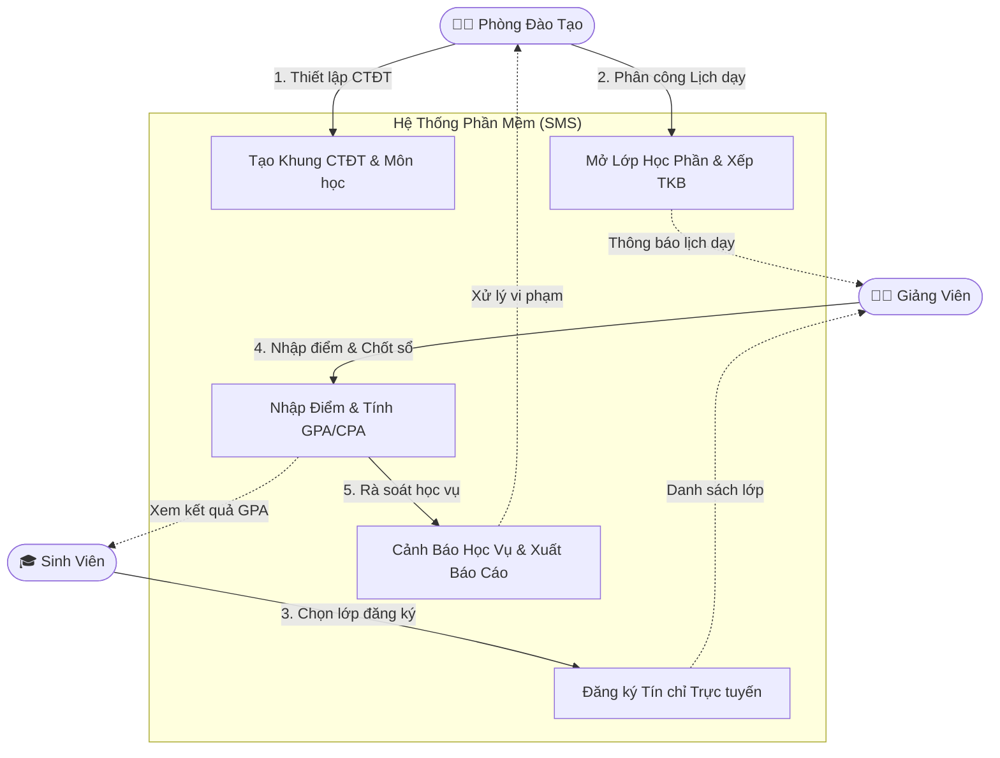

<div align="center">
  
  <h1>Hệ Thống Quản Lý Đào Tạo & Sinh Viên</h1>
  <p><strong>Student Management System (SMS / DoAnChuyenNganh)</strong></p>
  <p><em>Giải pháp phần mềm quản trị đại học toàn diện theo học chế tín chỉ: Lập kế hoạch đào tạo, xếp thời khóa biểu, đăng ký môn học, tính GPA/CPA tự động và cảnh báo học vụ.</em></p>

  
  
  
  
  
</div>

---

## 📑 MỤC LỤC NHANH
1. [Giới thiệu Dự án](#1-dự-án-này-giải-quyết-vấn-đề-gì)
2. [Chi tiết Tính năng theo Phân hệ](#2-chi-tiết-các-tính-năng)
3. [Sơ đồ Vận hành Hệ thống](#3-sơ-đồ-cách-hệ-thống-vận-hành)
4. [Cấu trúc Thư mục Dự án Chuẩn hóa (Directory Architecture)](#4-cấu-trúc-thư-mục-dự-án-chuẩn-hóa)
5. [Hướng dẫn Khởi chạy & Triển khai](#5-hướng-dẫn-khởi-chạy--triển-khai)
6. [Tài khoản Thử nghiệm](#6-tài-khoản-dùng-thử)
7. [Tối ưu hóa Hiệu năng & Truy xuất Dữ liệu](#7-tối-ưu-hóa-hiệu-năng--truy-xuất-dữ-liệu)
8. [Hệ thống Kiểm thử & Báo cáo Chất lượng](#8-hệ-thống-kiểm-thử--báo-cáo-chất-lượng)

---

## 📖 1. Dự án này giải quyết vấn đề gì?

Ở các trường Đại học, số lượng sinh viên, học phần và phòng học là vô cùng lớn. Việc vận hành thủ công dẫn đến nguy cơ xung đột lịch giảng dạy, sai sót tính toán học bổng và rủi ro chậm cảnh báo học vụ.

**Hệ thống SMS giải quyết trọn gói bài toán:**
- **Nhà trường (Phòng Đào Tạo):** Xây dựng khung chương trình đào tạo chuẩn 5 khối kiến thức, mở lớp học phần, xếp thời khóa biểu tự động, quản lý sĩ số và xuất báo cáo điểm/danh sách lớp sang Excel.
- **Giảng viên:** Theo dõi lịch giảng dạy hàng tuần, nhập điểm trực tuyến hoặc import từ Excel (cơ chế tính điểm 4 thành phần: CC1 5%, CC2 5%, GK 30%, CK 60%), khóa bảng điểm có thời hạn ân hạn 7 ngày.
- **Sinh viên:** Cổng đăng ký môn học trực quan phát hiện trùng lịch, tra cứu thời khóa biểu tuần, theo dõi tiến độ đào tạo (Curriculum Roadmap) và bảng điểm tích lũy (GPA/CPA).

---

## ✨ 2. Chi tiết các tính năng

### 🧑‍💼 Dành cho Phòng Đào Tạo (Quản trị viên)
- **Quản lý danh mục đào tạo:** Khoa (`departments`), Ngành (`majors`), Khóa (`cohorts`), Lớp hành chính (`classes`).
- **Khung chương trình đào tạo:** Quản lý 5 khối kiến thức chuẩn (Đại cương, Cơ sở ngành, Chuyên ngành...), cấu hình môn tiên quyết chống chu trình.
- **Quản lý lớp học phần & TKB:** Mở lớp, gán giảng viên, xếp lịch phòng học, theo dõi tỷ lệ lấp đầy sĩ số.
- **Cảnh báo học vụ tự động:** Phát hiện sinh viên có GPA học kỳ < 1.0 hoặc CPA < 2.0 để xử lý cảnh báo mức 1, mức 2 hoặc buộc thôi học.
- **Duyệt cấp lại mật khẩu & Phúc khảo điểm:** Xử lý các đơn khiếu nại điểm thi và yêu cầu cấp lại mật khẩu an toàn chống dò quét.

### 👨‍🏫 Dành cho Giảng Viên
- **Thời khóa biểu giảng dạy:** Xem lịch dạy theo tuần, phòng học, mã lớp học phần.
- **Nhập điểm & Import Excel:** Hỗ trợ nhập điểm trực tuyến hoặc nạp file Excel nhanh chóng; tự động quy đổi thang điểm 10 sang thang điểm 4 và điểm chữ.
- **Khóa bảng điểm (BR-07):** Giảng viên chốt điểm cuối kỳ; hỗ trợ sửa điểm trong cửa sổ ân hạn 7 ngày trước khi khóa cứng.

### 🎓 Dành cho Sinh Viên
- **Cổng đăng ký tín chỉ:** Kiểm tra tự động điều kiện môn tiên quyết, giới hạn tín chỉ (tối thiểu 10, tối đa 24 TC) và ngăn trùng lịch học.
- **Thời khóa biểu cá nhân:** Trực quan hóa lịch học theo ma trận thứ/tiết học trong tuần.
- **Bảng điểm & Tiến độ:** Xem GPA học kỳ, CPA tích lũy (áp dụng cơ chế chọn điểm cao nhất cho môn học lại) và lộ trình tốt nghiệp.
- **Phúc khảo điểm thi:** Gửi đơn phúc khảo trực tuyến cho từng thành phần điểm trong học kỳ.

---

## 🔄 3. Sơ đồ cách hệ thống vận hành



---

## 📂 4. Cấu trúc Thư mục Dự án Chuẩn hóa

Toàn bộ cây thư mục được sắp xếp khoa học, phân định rõ ràng giữa tầng logic ứng dụng, cơ sở dữ liệu, tài liệu đặc tả, kiểm thử và báo cáo:

```
DoAnChuyenNganh/
├── backend/                   # 🧠 Backend Spring Boot 3.5.6 (Java 23)
│   ├── src/main/java/com/sms/ # Mã nguồn chính: config, controller, dto, entity, service, repository
│   ├── src/main/resources/    # Cấu hình application.properties, banner, static templates
│   ├── src/test/java/com/sms/ # 25 test classes kiểm thử toàn diện 100% services (JUnit 5 & Mockito)
│   ├── Dockerfile             # Container hóa backend Spring Boot
│   └── pom.xml                # Quản lý dependencies (Maven)
│
├── frontend/                  # 💻 Frontend React 19 + Vite + Tailwind/Modern CSS
│   ├── src/components/        # Components tái sử dụng (common: Skeleton, ErrorBoundary; layout: Header, Sidebar)
│   ├── src/pages/             # Phân hệ màn hình: admin/, lecturer/, student/, auth/, shared/
│   ├── src/services/          # Tầng gọi API trung tâm (api.js, dataService.js)
│   ├── src/store/             # Quản lý state toàn cục (authStore, themeStore qua Zustand)
│   ├── src/utils/             # Hàm tiện ích (labels.js, export.js)
│   ├── src/tests/             # Kiểm thử đơn vị frontend (Vitest)
│   └── vite.config.js         # Cấu hình dev server proxy và rollup chunk optimization
│
├── database/                  # 🗄️ Thiết kế Cơ sở Dữ liệu & Tối ưu hóa (MySQL 8.0)
│   ├── schema.sql             # Canonical DDL: 18 bảng, views, composite indexes, triggers
│   ├── seed.sql               # Dữ liệu mẫu chuẩn hóa 22 ngành đào tạo, môn học và users
│   ├── migrations/            # Lịch sử 12 bản nâng cấp CSDL qua các giai đoạn
│   └── README.md              # 📖 Cẩm nang CSDL, Views, Indexes & SQL Recipes tối ưu truy xuất
│
├── docs/                      # 📚 Bộ Hồ sơ Phân tích Nghiệp vụ & Đặc tả Hệ thống
│   ├── 01_system_architecture_and_diagrams.md   # Kiến trúc 3 tầng & Data Flow
│   ├── 02_use_case_catalog.md                   # Phân rã 16+ Use Cases nghiệp vụ
│   ├── 03_use_case_specifications/              # Đặc tả chi tiết từng Use Case
│   ├── 04_business_rules.md                     # 10 quy tắc nghiệp vụ bất biến (BR-01..BR-10)
│   ├── 05_database_erd.md                       # Bản vẽ ERD & từ điển dữ liệu
│   ├── 06_academic_curriculum_catalog.md        # Khung CTĐT 22 ngành chuẩn Phenikaa
│   ├── 07_academic_curriculum_migration_plan.md # Kế hoạch tái cấu trúc dữ liệu
│   ├── 08_deployment_and_operations_guide.md    # Hướng dẫn triển khai chi tiết
│   ├── TAI_LIEU_TONG_QUAN_DU_AN.md              # Báo cáo tổng quan toàn diện đồ án
│   └── README.md                                # Mục lục tra cứu tài liệu hệ thống
│
├── drawio/                    # 📐 Sơ đồ thiết kế kiến trúc chuẩn (Draw.io)
│   ├── UseCase_Diagrams.drawio           # Sơ đồ Use Case tổng quan và 3 phân hệ
│   ├── Sequence_Diagrams.drawio          # 16 sơ đồ tuần tự chi tiết
│   ├── Activity_Diagrams.drawio          # 16 sơ đồ hoạt động
│   ├── AnalysisClass_BCE_Diagrams.drawio # 16 sơ đồ phân tích Boundary - Control - Entity
│   └── scripts/                          # Script Python tự động sinh sơ đồ
│
├── tests/                     # 🧪 Hệ thống Kiểm thử Tự động E2E & Hiệu năng
│   ├── e2e/                   # Test E2E toàn diện: comprehensive_system_test (56 cases), system_e2e
│   ├── performance/           # Test chịu tải & quá tải: overload_stress_test, enrollment_load
│   ├── integration/           # Test nghiệp vụ: điểm danh, import Excel, DevTools audit
│   ├── utils/                 # Tiện ích sinh JWT token hàng loạt, chụp màn hình
│   ├── reports/               # Báo cáo kết quả kiểm thử (Markdown)
│   ├── results/               # Dữ liệu kết quả chạy kiểm thử (JSON)
│   └── README.md              # Hướng dẫn thực thi các bộ kiểm thử
│
├── test-results/              # 📸 Bằng chứng Kiểm thử & Ảnh chụp Giao diện
│   ├── screenshots/           # Ảnh chụp giao diện UI và Thời khóa biểu
│   ├── devtools_screenshots/  # Ảnh chụp màn hình từ Headless Chrome DevTools
│   └── audit/                 # Nhật ký kiểm toán hiệu năng mạng và DOM
│
├── reports/                   # 📊 Báo cáo Học thuật & Kiểm toán Kỹ thuật
│   ├── progress/              # Báo cáo tiến độ đồ án & PTTKPM chuẩn Phenikaa (.docx)
│   ├── code_review/           # Báo cáo kiểm định toàn diện mã nguồn & bảo mật (.md)
│   └── README.md              # Mục lục danh mục báo cáo
│
├── scripts/                   # 🛠️ Tiện ích Vận hành & Hỗ trợ
│   ├── capture_screenshots.mjs # Tự động chụp ảnh toàn bộ các màn hình web
│   ├── convert_to_jpg.ps1     # Chuyển đổi hàng loạt ảnh chụp sang JPG
│   └── README.md              # Hướng dẫn tiện ích
│
├── start_dev.bat              # ⚡ Khởi động toàn bộ hệ thống bằng 1 click trên Windows
├── run_tests.bat              # 🧪 Menu chạy nhanh các bộ kiểm thử tự động
├── share_internet.bat         # 🌐 Mở đường hầm Internet công khai (Cloudflare Tunnel) để demo
├── docker-compose.yml         # Triển khai trọn gói MySQL + Backend + Frontend qua Docker
├── DEPLOY_GUIDE.md            # Hướng dẫn triển khai nhanh tại thư mục gốc
└── README.md                  # Tài liệu trung tâm này
```

---

## 🚀 5. Hướng dẫn Khởi chạy & Triển khai

### Cách 1: Chạy 1-Click trên Windows (Nhanh nhất cho nhà phát triển)
1. Nhấp đúp chuột vào tệp **`start_dev.bat`** ở thư mục gốc.
2. Script sẽ tự động nhận diện MySQL (cổng 3306 hoặc 3308), khởi động Backend (cổng 8080) và bật Frontend Vite (cổng 5173).
3. Truy cập ứng dụng tại: `http://localhost:5173`

### Cách 2: Chạy trọn gói qua Docker Compose
```bash
docker compose up --build -d
```
Sau đó truy cập: `http://localhost:5173`

### Cách 3: Chia sẻ đường link Demo ra ngoài Internet (Không cần mở cổng Router)
Nhấp đúp chuột vào tệp **`share_internet.bat`** và chọn `1` (Cloudflare Tunnel). Bạn sẽ nhận ngay đường link HTTPS công khai để gửi cho thầy cô hoặc bạn bè dùng thử trên điện thoại/laptop cá nhân.

---

## 🔐 6. Tài khoản Dùng thử

Hệ thống đã nạp sẵn dữ liệu tài khoản mẫu với mật khẩu mặc định là `123456`:

| Phân hệ / Vai trò | Tên đăng nhập | Mật khẩu | Quyền hạn chính |
| :--- | :--- | :--- | :--- |
| **Phòng Đào Tạo (Admin)** | `admin` | `123456` | Toàn quyền cấu hình CTĐT, mở lớp, xếp TKB, duyệt mật khẩu, xem cảnh báo học vụ |
| **Giảng Viên** | `1000001` | `123456` | Xem TKB cá nhân, nhập/khóa điểm học phần, xuất/nhập Excel |
| **Sinh Viên** | `2500001` | `123456` | Đăng ký tín chỉ, xem TKB tuần, xem bảng điểm GPA/CPA, nộp đơn phúc khảo |

---

## ⚡ 7. Tối ưu hóa Hiệu năng & Truy xuất Dữ liệu

Nhằm đảm bảo hệ thống có thể xử lý mượt mà khi hàng ngàn sinh viên truy cập đăng ký môn học và tra cứu kết quả đồng thời:

1. **Khử triệt để N+1 Query Storm qua Database Views:**
   * Sử dụng [`v_student_transcript`](database/README.md#view-1-v_student_transcript-bảng-điểm-chi-tiết-toàn-bộ-học-kỳ) để nạp toàn bộ bảng điểm, môn học, học kỳ chỉ trong **1 câu truy vấn**.
   * Sử dụng [`v_student_gpa`](database/README.md#view-2-v_student_gpa-gpa-tích-lũy--tín-chỉ-tích-lũy) để tính toán điểm tích lũy và tín chỉ đạt được mà không cần quét toàn bộ bảng sinh viên trong bộ nhớ.
2. **Hệ thống Composite Indexes tốc độ cao:**
   * `idx_enrollments_student_status` phục vụ tra cứu TKB và kiểm tra số tín chỉ đã đăng ký `O(log N)`.
   * `idx_enrollments_section_status` kiểm tra tức thì sĩ số lớp học phần không lock table.
   * `idx_sections_semester_status` tăng tốc lọc lớp học phần trong thời gian mở cổng đăng ký.
   * `idx_schedules_section_dates` phục vụ thuật toán phát hiện xung đột lịch học.
3. **Chi tiết tra cứu:** Xem chi tiết tại [Cẩm nang Tối ưu hóa CSDL (`database/README.md`)](database/README.md).

---

## 🧪 8. Hệ thống Kiểm thử & Báo cáo Chất lượng

Hệ thống được bảo vệ bởi mạng lưới kiểm thử tự động đa tầng:
* **Backend Unit & Regression Tests:** 25 test classes với 160+ test cases viết bằng JUnit 5 & Mockito (`mvn test`).
* **Frontend Tests:** Bộ kiểm thử hàm tiện ích và quản lý state (`npm test` qua Vitest).
* **Deep System E2E Testing:** 56 test cases bao quát mọi rủi ro bảo mật (SQLi, XSS, RBAC) và quy tắc nghiệp vụ (`tests/e2e/comprehensive_system_test.js`).
* **Overload & Stress Benchmarks:** Thử tải áp lực kết nối cơ sở dữ liệu HikariCP và Tomcat Thread Pool (`tests/performance/overload_stress_test.js`).
* **Báo cáo Kiểm định Toàn diện:** Xem tại [`reports/code_review/code_review_report.md`](reports/code_review/code_review_report.md).

---
*Phát triển và hoàn thiện bởi DevMarkie — 2026*
