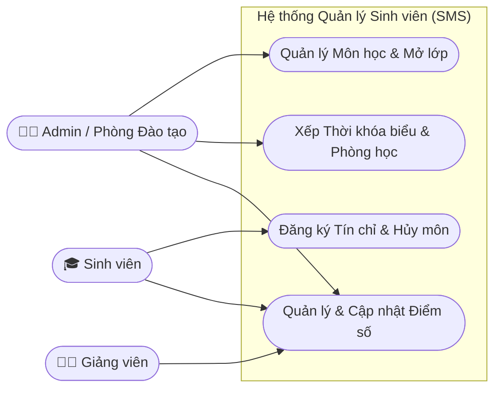

<div align="center">
  
  <h1>Hệ Thống Quản Lý Đào Tạo & Sinh Viên</h1>
  <p><strong>Student Management System (SMS)</strong></p>
  <p><em>Đồ án chuyên ngành - Xây dựng theo tiêu chuẩn tín chỉ hiện đại</em></p>

  
  
  
  
  
</div>

---

## 📌 Tổng Quan Hệ Thống

Hệ thống quản lý sinh viên được xây dựng nhằm tin học hóa và tối ưu quy trình quản lý học tập, giảng dạy và vận hành đào tạo trong trường đại học theo học chế tín chỉ.

### 🎭 Phân hệ người dùng

1. 🧑‍💼 **Quản trị viên (Admin):** Phân quyền, quản lý khoa/ngành, lớp học, học phần, lịch trình đào tạo và cấu hình thời gian đăng ký tín chỉ.
2. 👨‍🏫 **Giảng viên (Lecturer):** Xem lịch giảng dạy, danh sách lớp, nhập và khóa điểm (chuyên cần, giữa kỳ, cuối kỳ).
3. 🎓 **Sinh viên (Student):** Đăng ký tín chỉ trực tuyến, tra cứu thời khóa biểu, xem điểm và bảng điểm tích lũy.

### 🗺️ Sơ đồ Use Case Tổng Quan



---

## 🛠️ Công Nghệ Sử Dụng

### ⚙️ Backend (Core)
- **Framework:** Spring Boot 3.5.6 (Spring Data JPA, Spring Security, Spring Web)
- **Security:** JWT Authentication, Role-based access control (RBAC)
- **Database:** MySQL 8.x + HikariCP Connection Pool
- **Documentation:** SpringDoc OpenAPI / Swagger UI 3.0

### 🎨 Frontend (Client)
- **Framework:** React 19 (Vite)
- **Routing & State:** React Router v7, Zustand
- **Styling:** Vanilla CSS (Glassmorphism, Dark/Light Theme), Lucide Icons
- **HTTP Client:** Axios (với Interceptors xử lý token)

---

## 📂 Cấu Trúc Thư Mục

```text
DoAnChuyenNganh/
├── backend/                  # Mã nguồn Spring Boot Backend (Java 23)
├── frontend/                 # Mã nguồn React Frontend (Vite)
├── database/                 # Cơ sở dữ liệu MySQL chuẩn hóa (Schema & Seed)
├── docs/                     # Tài liệu phân tích nghiệp vụ & thiết kế chuẩn BA
├── drawio/                   # Các sơ đồ thiết kế UML nguyên bản
├── reports/                  # Báo cáo tiến độ & mẫu báo cáo (.docx)
├── tests/                    # Bộ kịch bản & báo cáo kiểm thử tự động
├── docker-compose.yml        # Cấu hình cụm dịch vụ Docker
├── start_dev.bat             # 1-Click khởi động toàn bộ môi trường
└── README.md
```

---

## 🚀 Hướng Dẫn Cài Đặt & Khởi Chạy

### Cách 1: Khởi chạy nhanh 1-Click (Khuyên dùng trên Windows)
Chỉ cần nhấp đúp chuột vào file **`start_dev.bat`** tại thư mục gốc. Hệ thống sẽ tự động nạp Database, Backend và Frontend.

### Cách 2: Triển khai trọn gói bằng Docker
Khởi chạy MySQL, Backend và Frontend (qua Nginx) với duy nhất 1 lệnh:
```bash
docker compose up --build -d
```
- **Web App:** `http://localhost:5173`
- **Swagger API:** `http://localhost:8080/swagger-ui.html`

> 📖 **Ghi chú:** Để xem hướng dẫn chia sẻ mạng LAN, đưa lên mạng (Internet Tunnel) hoặc Deploy lên Cloud, vui lòng tham khảo [DEPLOY_GUIDE.md](DEPLOY_GUIDE.md).

---

## 🔐 Tài Khoản Truy Cập Mặc Định

Sử dụng các tài khoản sau để đăng nhập vào hệ thống (đã được tạo sẵn trong Database mẫu):

| Vai trò | Tên đăng nhập | Mật khẩu | Ghi chú |
| :--- | :--- | :--- | :--- |
| **Admin** | `admin` | `123456` | Toàn quyền quản trị |
| **Giảng viên** | `1000001` | `123456` | Danh sách GV từ `1000001` đến `1000025` |
| **Sinh viên** | `2300001` | `123456` | Khóa K17 (đủ GPA). Hoặc K19: `2500001` |

---
*Phát triển bởi DevMarkie - 2026*
