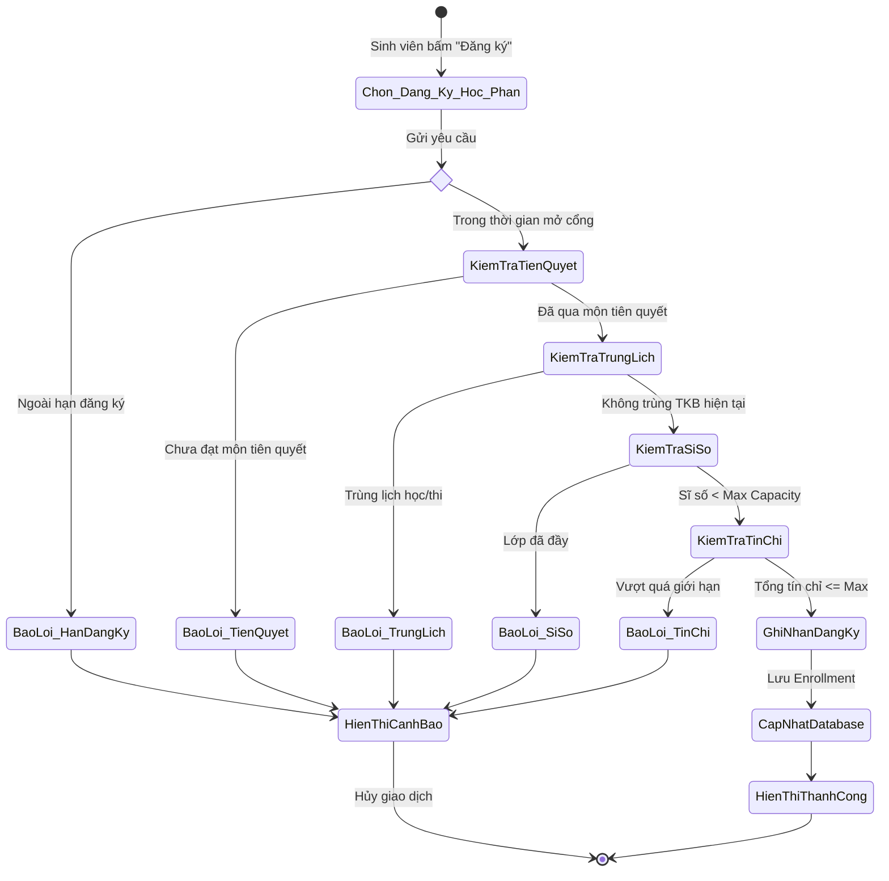
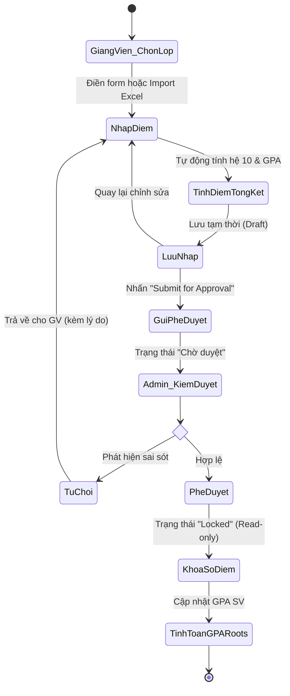
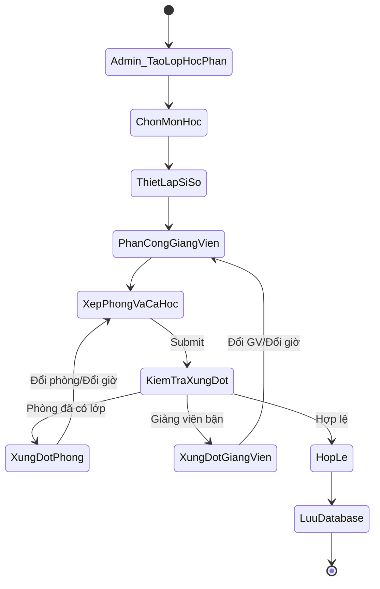
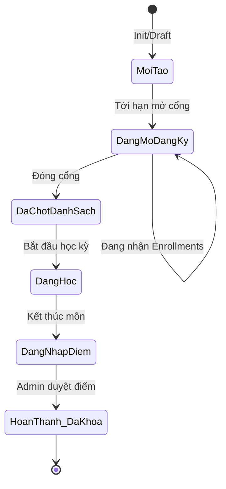
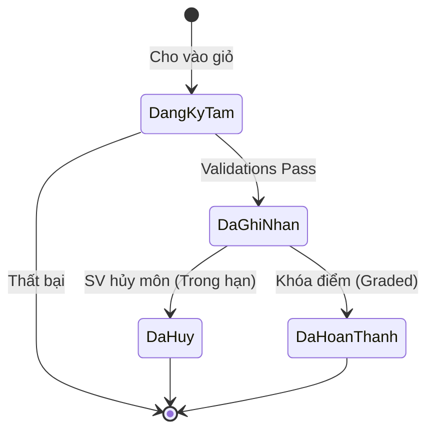

# SƠ ĐỒ KIẾN TRÚC & HOẠT ĐỘNG HỆ THỐNG (SYSTEM DIAGRAMS)

## 1. Sơ đồ Hoạt động (Activity Diagrams)

### Luồng 1: Quy trình Sinh viên Đăng ký lớp học phần

### Luồng 2: Quy trình Nhập, Duyệt và Khóa sổ điểm

### Luồng 3: Quy trình Admin Mở lớp và Gán lịch học

## 2. Sơ đồ Chuyển trạng thái (State Machine Diagram)

### Vòng đời Lớp học phần

### Vòng đời Đăng ký môn (Enrollment)

