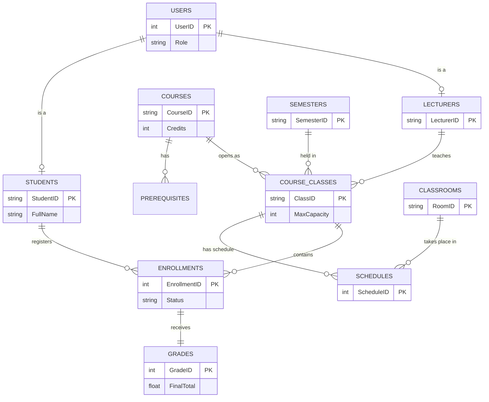

# DATABASE ERD & DATA DICTIONARY

## 1. ERD (Entity Relationship Diagram)

## 2. Data Dictionary (Trọng yếu)

- **COURSE_CLASSES (Lớp học phần):**
  - `ClassID (PK)`: SE101.L01
  - `CourseID (FK)`: SE101
  - `Status`: IN ('Draft', 'Open', 'Closed', 'Graded')

- **ENROLLMENTS (Giao dịch Đăng ký):**
  - Bảng trung gian giải quyết quan hệ N-M giữa Sinh viên và Lớp học phần.
  - `EnrollmentID (PK)`: ID tự sinh.
  - `Status`: IN ('Enrolled', 'Dropped'). Cho phép Soft-delete.

- **GRADES (Bảng điểm):**
  - `EnrollmentID (FK)`: Unique relation 1-1 với Enrollment.
  - `FinalTotal`: Tính toán bằng Trigger/Service Layer.
