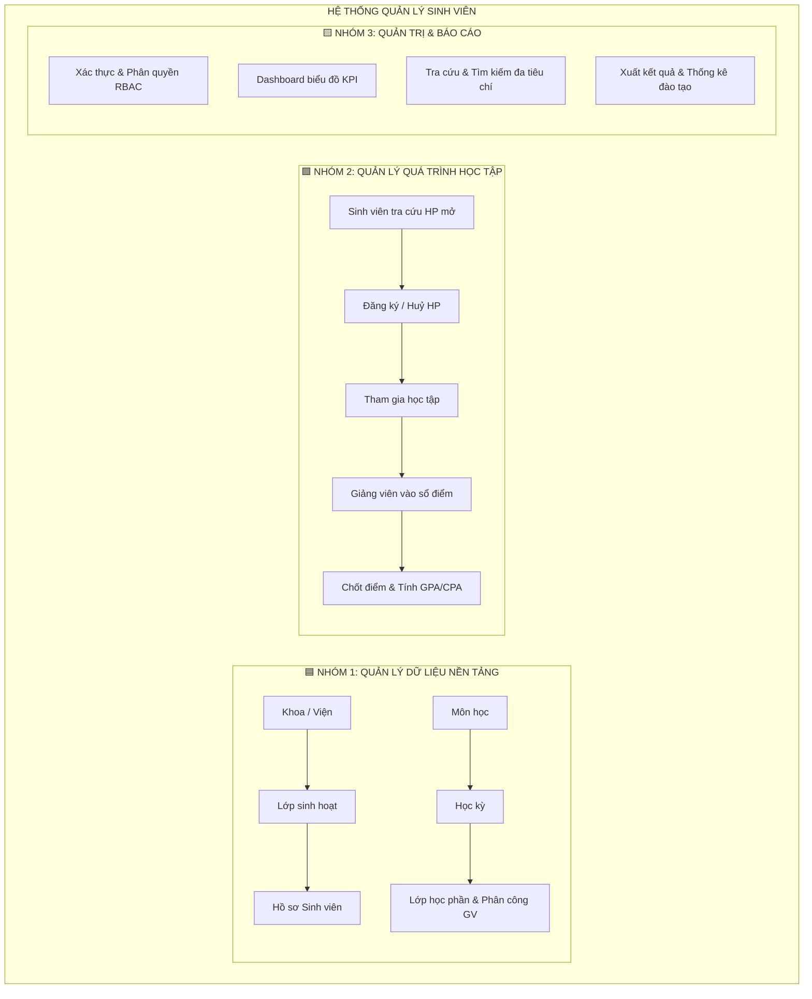
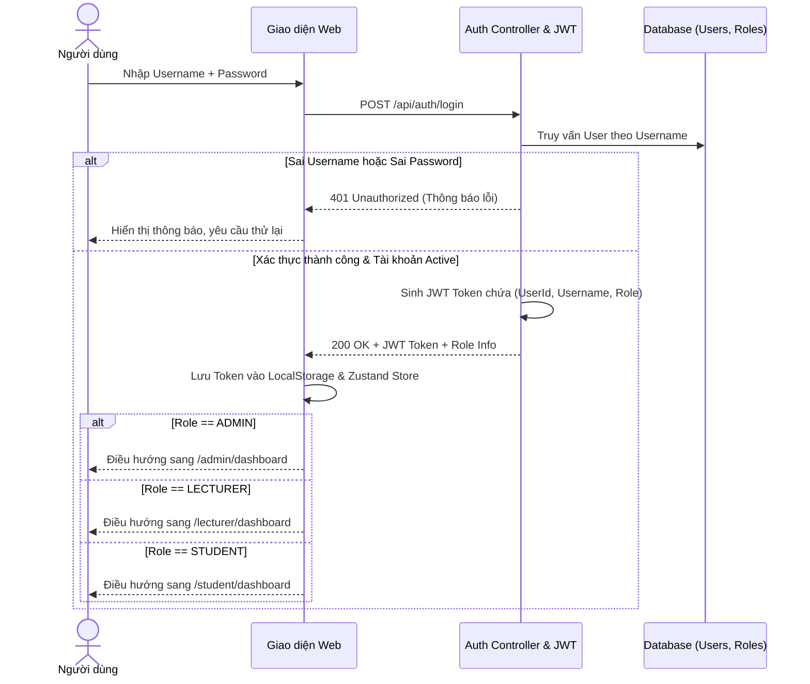
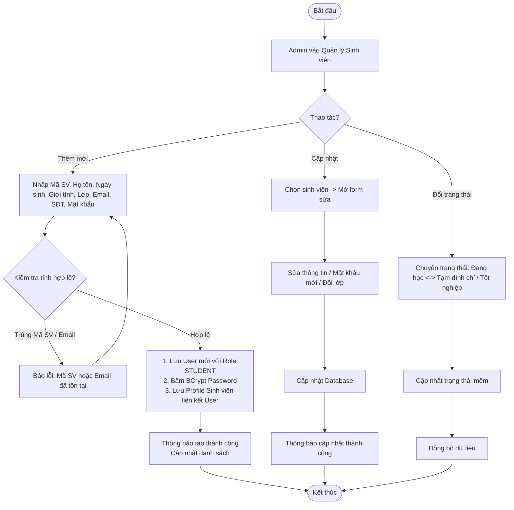
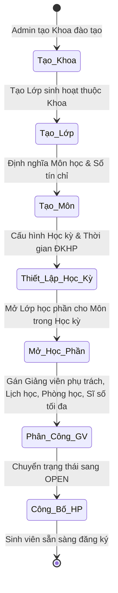
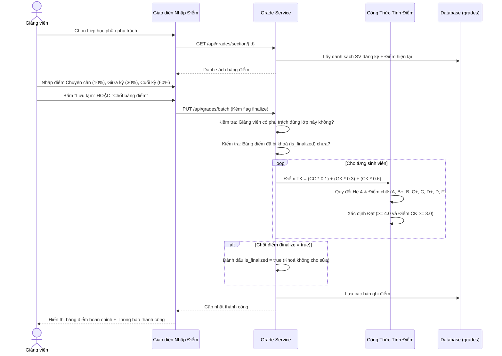
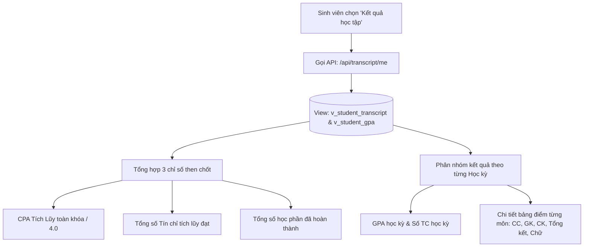

# TÀI LIỆU PHÂN TÍCH NGHIỆP VỤ HỆ THỐNG (BA SPECIFICATION)
## Đề tài: Hệ Thống Quản Lý Sinh Viên Trên Nền Tảng Web (Student Management System)
**Phiên bản:** 2.0  
**Tác giả:** Business Analyst (BA)  
**Trạng thái:** Approved & Implemented  

---

## 1. TỔNG QUAN HỆ THỐNG & 3 NHÓM NGHIỆP VỤ CỐT LÕI

Hệ thống được cấu trúc xoay quanh **3 nhóm nghiệp vụ lớn** tạo nên "xương sống" vững chắc của toàn bộ quy trình đào tạo:



---

## 2. CHI TIẾT 8 QUY TRÌNH NGHIỆP VỤ CHÍNH (BUSINESS PROCESSES)

### Quy trình 1: Đăng nhập và Phân quyền (Authentication & RBAC)
* **Mục tiêu:** Xác thực danh tính người dùng và cấp quyền truy cập chính xác theo vai trò.
* **Tác nhân (Actor):** Admin, Giảng viên, Sinh viên.



* **Business Rules áp dụng:**
  * `BR-01`: Mỗi tài khoản chỉ thuộc 1 vai trò duy nhất (`ADMIN`, `LECTURER`, `STUDENT`).
  * `BR-02`: Mọi API nghiệp vụ được bảo vệ bởi Filter JWT (`Bearer Token`). Người dùng không thể truy cập tài nguyên vượt quá quyền hạn của Role (HTTP 403 Forbidden nếu vi phạm).

---

### Quy trình 2: Quản lý Thông tin Sinh viên (Student Profile Lifecycle)
* **Mục tiêu:** Quản lý toàn vẹn hồ sơ nhân thân, lớp sinh hoạt và vòng đời học tập của sinh viên từ khi nhập học đến khi ra trường.
* **Tác nhân:** Admin.



* **Business Rules áp dụng:**
  * `BR-03`: `student_code` là duy nhất toàn hệ thống, không thay đổi sau khi tạo.
  * `BR-04`: Sinh viên bắt buộc phải gắn với 1 lớp sinh hoạt (`class_id`). Lớp sinh hoạt phải thuộc 1 Khoa cụ thể (`department_id`).
  * `BR-05`: **Không xóa cứng (Hard Delete)** sinh viên nếu đã phát sinh lịch sử đăng ký học phần hoặc điểm số; chỉ áp dụng **Xóa mềm / Chuyển trạng thái** (`ACTIVE`, `SUSPENDED`, `GRADUATED`).
  * `BR-06`: Tự động kích hoạt tài khoản đăng nhập với `username = student_code.toLowerCase()` và mật khẩu khởi tạo (mặc định `123456` hoặc do Admin nhập).

---

### Quy trình 3: Quản lý Đào tạo (Master Training Structure)
* **Chuỗi nghiệp vụ phân cấp:**
  $$\text{Khoa (Department)} \longrightarrow \text{Lớp (Class)} \longrightarrow \text{Môn học (Subject)} \longrightarrow \text{Học kỳ (Semester)} \longrightarrow \text{Lớp học phần (Course Section)} \longrightarrow \text{Phân công GV (Lecturer)}$$



* **Business Rules áp dụng:**
  * `BR-07`: Một môn học có số tín chỉ từ 1 đến 10 TC.
  * `BR-08`: Mỗi học phần bắt buộc có: 1 Môn học, 1 Học kỳ, 1 Giảng viên giảng dạy, Sĩ số tối đa (`max_students`), Lịch học và Phòng học.

---

### Quy trình 4: Đăng ký Học phần (Course Registration)
* **Mục tiêu:** Cho phép sinh viên chủ động đăng ký các môn học trong học kỳ hiện tại theo nguyện vọng và kế hoạch đào tạo.
* **Tác nhân:** Sinh viên.

```mermaid
flowchart TD
    A([Sinh viên đăng nhập]) --> B[Vào mục Đăng ký học phần]
    B --> C[Hệ thống tải Học kỳ hiện tại & Danh sách HP đang OPEN]
    C --> D[Sinh viên chọn 1 lớp học phần -> Bấm Đăng ký]
    D --> CheckTime{Trong đợt ĐKHP?<br/>reg_start <= Now <= reg_end}
    CheckTime -->|Không| ErrTime[Báo lỗi: Ngoài thời gian đăng ký]
    CheckTime -->|Có| CheckDup{Đã đăng ký lớp này chưa?}
    CheckDup -->|Đã đăng ký| ErrDup[Báo lỗi: Bạn đã đăng ký học phần này]
    CheckDup -->|Chưa| CheckCap{Sĩ số hiện tại < maxStudents?}
    CheckCap -->|Đầy| ErrCap[Báo lỗi: Lớp học phần đã đủ sĩ số]
    CheckCap -->|Còn chỗ| CheckCredit{Tổng TC kỳ này + Môn này <= 30 TC?}
    CheckCredit -->|Vượt| ErrCred[Báo lỗi: Vượt quá số tín chỉ tối đa / kỳ]
    CheckCredit -->|Đủ điều kiện| ExecuteEnroll[1. Lưu bản ghi Enrollment (status: ENROLLED)<br/>2. Tự động tăng current_students + 1]
    ExecuteEnroll --> SuccessToast[Thông báo Đăng ký thành công!]
    SuccessToast --> RefreshTable[Cập nhật trạng thái: Đã đăng ký]
```

* **Quy trình Huỷ đăng ký:**
  * Sinh viên vào trang "HP đã đăng ký".
  * Chọn học phần muốn huỷ -> Bấm icon Thùng rác.
  * Hệ thống xác nhận -> Chuyển trạng thái Enrollment sang `CANCELLED` -> Giảm `current_students` đi 1.

---

### Quy trình 5: Quản lý & Vào Sổ Điểm (Grade Processing)
* **Mục tiêu:** Giảng viên nhập điểm thành phần; hệ thống tự động tính điểm tổng kết và xếp loại.
* **Tác nhân:** Giảng viên phụ trách lớp, Admin.



* **Thang quy đổi chuẩn:**
  * $8.5 \le \text{Điểm} \le 10.0 \implies \text{Điểm chữ: } \mathbf{A} \implies \text{Hệ 4: } \mathbf{4.0}$
  * $8.0 \le \text{Điểm} < 8.5 \implies \text{Điểm chữ: } \mathbf{B+} \implies \text{Hệ 4: } \mathbf{3.5}$
  * $7.0 \le \text{Điểm} < 8.0 \implies \text{Điểm chữ: } \mathbf{B} \implies \text{Hệ 4: } \mathbf{3.0}$
  * $6.5 \le \text{Điểm} < 7.0 \implies \text{Điểm chữ: } \mathbf{C+} \implies \text{Hệ 4: } \mathbf{2.5}$
  * $5.5 \le \text{Điểm} < 6.5 \implies \text{Điểm chữ: } \mathbf{C} \implies \text{Hệ 4: } \mathbf{2.0}$
  * $5.0 \le \text{Điểm} < 5.5 \implies \text{Điểm chữ: } \mathbf{D+} \implies \text{Hệ 4: } \mathbf{1.5}$
  * $4.0 \le \text{Điểm} < 5.0 \implies \text{Điểm chữ: } \mathbf{D} \implies \text{Hệ 4: } \mathbf{1.0}$
  * $\text{Điểm} < 4.0 \implies \text{Điểm chữ: } \mathbf{F} \implies \text{Hệ 4: } \mathbf{0.0} \implies \text{Học lại}$

---

### Quy trình 6: Tra Cứu Kết Quả Học Tập (Academic Transcript & CPA)
* **Mục tiêu:** Sinh viên theo dõi tiến độ tích lũy, điểm GPA từng kỳ và CPA toàn khóa.
* **Tác nhân:** Sinh viên.



---

### Quy trình 7 & 8: Tra Cứu, Báo Cáo & Thống Kê (Search, Filters & Dashboard KPIs)
* **Admin Dashboard:**
  * 8 thẻ KPI thời gian thực: Tổng SV, SV đang học, Giảng viên, Khoa, Lớp, Môn học, Học phần mở, SV tốt nghiệp.
  * 2 biểu đồ trực quan:
    1. Biểu đồ cột: Phân bố số lượng sinh viên theo từng Khoa đào tạo.
    2. Biểu đồ tròn: Cơ cấu trạng thái sinh viên (Đang học, Tốt nghiệp, Tạm đình chỉ).
* **Tra cứu nâng cao:**
  * Tìm kiếm tức thời (Debounced search) theo từ khóa: Mã SV, Họ tên, Email.
  * Lọc theo dropdown: Lọc danh sách sinh viên theo Lớp sinh hoạt; lọc lớp theo Khoa; lọc học phần theo Học kỳ.

---

## 3. MA TRẬN ĐẶC TẢ USE CASE CHI TIẾT (USE CASE SPECIFICATIONS)

| Mã Use Case | Tên Use Case | Tác Nhân (Actor) | Tiền điều kiện (Pre-condition) | Hậu điều kiện (Post-condition) |
| :--- | :--- | :--- | :--- | :--- |
| **UC-01** | Đăng nhập hệ thống | Khách / Người dùng | Người dùng có tài khoản đang Active | Cấp JWT Token, điều hướng đúng Dashboard theo Role |
| **UC-02** | Xem Dashboard thống kê | Admin | Đã đăng nhập vai trò ADMIN | Hiển thị 8 thẻ số liệu và 2 biểu đồ phân tích |
| **UC-03** | Thêm mới Sinh viên | Admin | Đã đăng nhập vai trò ADMIN | Tạo hồ sơ SV + Tự động kích hoạt tài khoản User |
| **UC-04** | Cập nhật hồ sơ SV | Admin | Sinh viên tồn tại trong hệ thống | Dữ liệu hồ sơ/mật khẩu được cập nhật thành công |
| **UC-05** | Quản lý Đào tạo (Khoa/Lớp/Môn) | Admin | Đã đăng nhập vai trò ADMIN | Tạo/sửa Khoa, Lớp sinh hoạt, Môn học, Niên khóa |
| **UC-06** | Mở lớp Học phần & Phân công | Admin | Môn học, Học kỳ, Giảng viên đã tồn tại | Lớp học phần ở trạng thái OPEN, sẵn sàng cho SV đăng ký |
| **UC-07** | Đăng ký Học phần | Sinh viên | Đã đăng nhập vai trò STUDENT, trong hạn ĐKHP | Tạo bản ghi Enrollment, tăng số lượng SV đã đăng ký |
| **UC-08** | Huỷ đăng ký Học phần | Sinh viên | Học phần đang ở trạng thái ENROLLED | Chuyển Enrollment sang CANCELLED, giảm sĩ số lớp |
| **UC-09** | Nhập & Chốt điểm học phần | Giảng viên | Giảng viên được phân công đúng lớp HP | Điểm lưu DB, tự tính điểm hệ 10/4/chữ, khoá bảng điểm |
| **UC-10** | Tra cứu bảng điểm & GPA | Sinh viên | Đã đăng nhập vai trò STUDENT | Hiển thị CPA tích lũy, tín chỉ đạt, chi tiết từng kỳ |

---

## 4. BẢNG DANH MỤC QUY TẮC NGHIỆP VỤ (BUSINESS RULES CATALOG)

| Mã BR | Tên Quy Tắc | Mô Tả Chi Tiết & Ràng Buộc Kiểm Soát | Triển Khai Trong Code |
| :--- | :--- | :--- | :--- |
| `BR-AUTH-01` | Phân quyền vai trò nghiêm ngặt | Chỉ cho phép 3 Role: `ADMIN`, `LECTURER`, `STUDENT`. Không cấp quyền chéo. | `SecurityConfig.java`, `JwtAuthFilter.java` |
| `BR-STU-01` | Tính duy nhất của Mã SV | Mỗi sinh viên có 1 `student_code` duy nhất, không trùng lặp. | `StudentRepository.existsByStudentCode()` |
| `BR-STU-02` | Tự động sinh tài khoản User | Thêm SV hoặc GV tự sinh User với `username = code.toLowerCase()`, mật khẩu mã hóa BCrypt. | `StudentService.java`, `LecturerService.java` |
| `BR-STU-03` | Không xoá cứng hồ sơ | Bảo toàn dữ liệu đào tạo bằng cách chỉ chuyển đổi trạng thái `ACTIVE`, `SUSPENDED`, `GRADUATED`. | `Student.java`, `StudentService.updateStatus()` |
| `BR-ENR-01` | Trạng thái học phần mở | Chỉ được đăng ký khi học phần có `status == 'OPEN'`. | `EnrollmentService.enroll()` |
| `BR-ENR-02` | Ràng buộc sĩ số tối đa | Không cho phép đăng ký vượt quá `max_students` của lớp học phần. | `EnrollmentService.enroll()` |
| `BR-ENR-03` | Chống đăng ký trùng | Một sinh viên chỉ được có 1 lượt đăng ký `ENROLLED` trên cùng 1 lớp học phần. | `EnrollmentRepository.existsByStudentIdAndSectionId()` |
| `BR-ENR-04` | Giới hạn tín chỉ kỳ học | Tổng số tín chỉ đăng ký trong 1 học kỳ không được vượt quá 30 TC. | `MAX_CREDITS_PER_SEMESTER = 30` |
| `BR-GRD-01` | Phân quyền vào điểm | Giảng viên chỉ được nhập điểm cho lớp học phần mà mình được phân công giảng dạy. | `GradeService.saveGrade()` |
| `BR-GRD-02` | Công thức tính điểm tổng kết | $\text{Điểm TK} = (\text{CC} \times 0.1) + (\text{GK} \times 0.3) + (\text{CK} \times 0.6)$, làm tròn 2 chữ số thập phân. | `Grade.calculateTotalScore()` |
| `BR-GRD-03` | Khóa điểm sau khi chốt | Khi bảng điểm đã được `is_finalized = true`, giảng viên không thể tự ý sửa đổi. | `GradeService.saveGrade()` |

---

## 5. BẢN ĐỒ ÁNH XẠ NGHIỆP VỤ SANG KIẾN TRÚC MÃ NGUỒN

```text
Quy trình BA                                Backend Controller / Service               Frontend Page Component
──────────────────────────────────────────────────────────────────────────────────────────────────────────────────
1. Đăng nhập & Phân quyền                  AuthController, AuthService, JwtUtil       LoginPage.jsx, authStore.js
2. Quản lý Sinh viên                       StudentController, StudentService          StudentsPage.jsx
3. Quản lý Đào tạo (Khoa, Lớp, Môn, Kỳ)    DepartmentController, ClassController,     DepartmentsPage.jsx, ClassesPage.jsx,
                                           SubjectController, SemesterController      SubjectsPage.jsx, SemestersPage.jsx
4. Mở Học phần & Đăng ký                   CourseSectionController, EnrollmentCtrl    CourseSectionsPage.jsx, EnrollPage.jsx,
                                           CourseSectionService, EnrollmentService    MySectionsPage.jsx, MyEnrollmentsPage.jsx
5. Quản lý & Vào sổ điểm                   GradeController, GradeService              GradeEntryPage.jsx, AdminGradesPage.jsx
6. Xem kết quả học tập & CPA               TranscriptController, TranscriptService    TranscriptPage.jsx, StudentDashboard.jsx
7. Thống kê & Báo cáo                      DashboardController, DashboardService      DashboardPage.jsx, Layout.jsx
```
